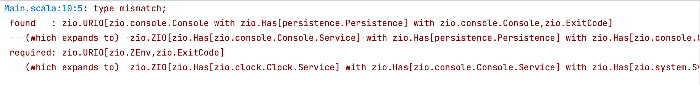
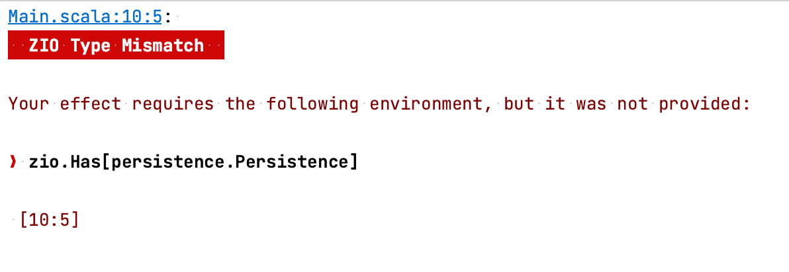
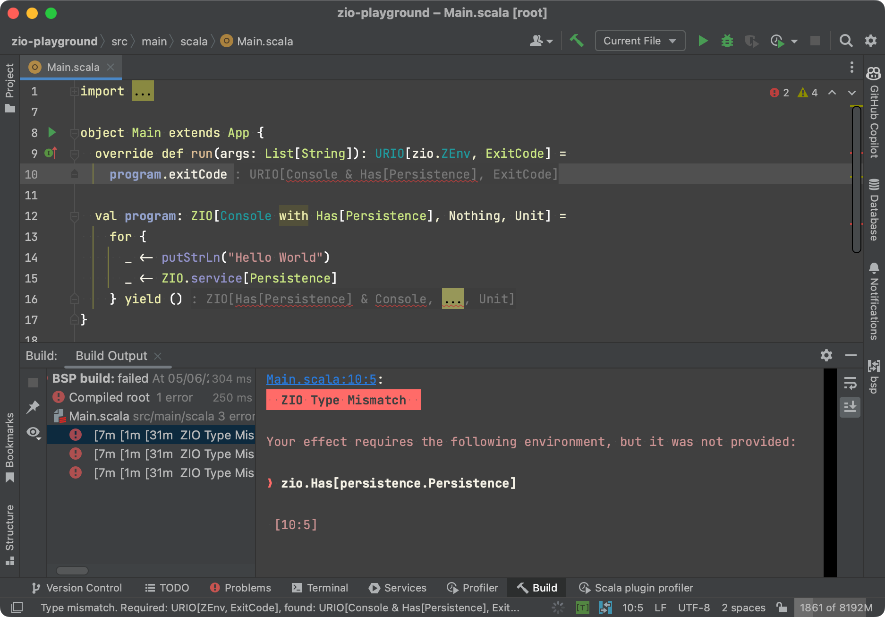
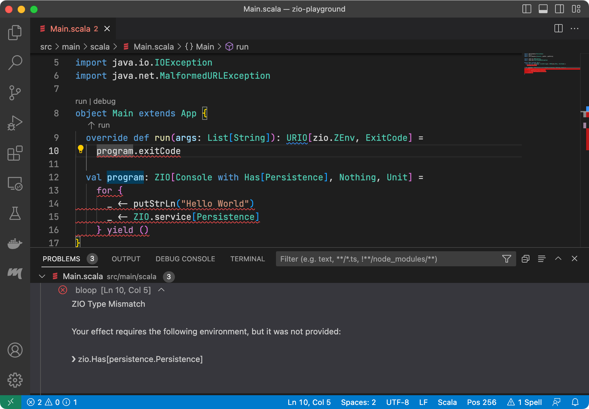
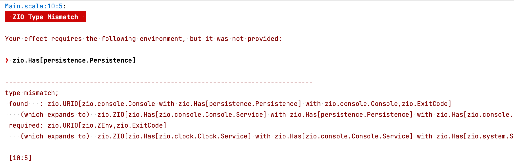

# ZIO Clippy

A Scala compiler plugin for better ZIO type mismatch errors.

Go from this:



To this:



IntelliJ IDEA   |  VSCode / Metals
:--------------:|:---------------:
 | 

## Getting started


Add the following to your `build.sbt` to install the plugin in your project:

```scala
addCompilerPlugin("com.hmemcpy" %% "zio-clippy" % "0.0.1")
```

(replace with the latest available version from Maven Central)

Reload your project, and any ZIO type mismatch errors will now be rendered in a nice output. This works with all build servers (sbt, bsp) and all editors (IntelliJ IDEA, VSCode/Metals).

The plugin supports Scala 2.12, 2.13 with Scala 3 support coming soon! The plugin supports both ZIO 1 and ZIO 2.

### Alternative installation method

Another way to install the plugin that does not require manually adding it to your `build.sbt` is to install it as a global sbt plugin:

1. Checkout this repository
2. Run `sbt +install`
3. In your project, reload sbt/bsp

Running `sbt install` builds and places the plugin jar and the [`ZIOPlugin.scala`](https://github.com/hmemcpy/zio-clippy/blob/master/project/ZIOPlugin.scala) file in the global `~/.sbt/1.0/plugins` directory, allowing any sbt project to load the plugin automatically. To remove, delete the ZIOPlugin.scala file from `~/.sbt/1.0/plugins`.

## Additional configuration

To render the original type mismatch error in addition to the plugin output, add the following flag to your `scalacOptions`:

```scala
"-P:clippy:show-original-error"
```




## Technical information

This plugin implements a custom `Reporter` class, intercepting any `type mismatch` errors that contain ZIO-specific information (it's all regex!) with all other errors passing through to the underlying reporter.

The plugin tries to extract the *found* and *required* dependencies from the error message and performs a set diff to remove the found types from the required ones. This leaves just the type(s) that are missing/were not provided to the effect.

## Acknowledgments

The project borrows some ideas from Sam Halliday's excellent [Ensime TNG](https://ensime.github.io/), for both the local development setup and the _hack_ to replace the reporter.

In addition, the ANSI rendering is heavily inspired by Kit Langton's excellent work on [zio-magic](https://github.com/kitlangton/zio-magic), which is also part of ZIO 2's default error rendering.

## Bugs? Suggestions?

Let us know! Report an issue or send a PR!
