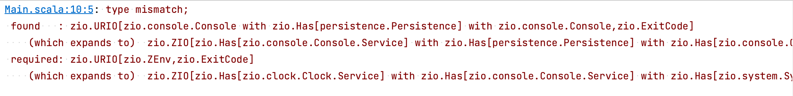
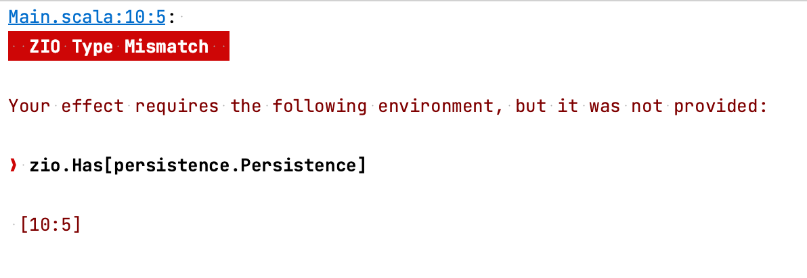
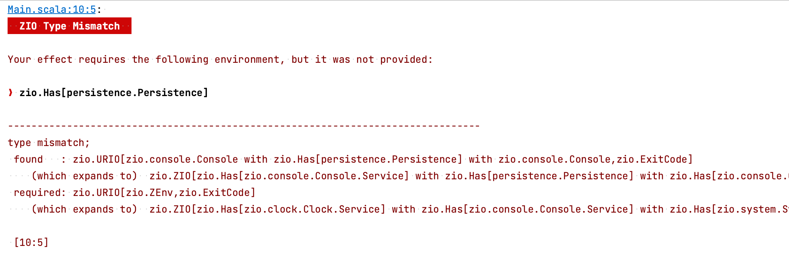

# zio-clippy

A Scala compiler plugin for better ZIO type mismatch errors.

Go from this:



To this:



## Getting started


Add the following to your `build.sbt` to install the plugin in your project:

```scala
addCompilerPlugin("com.hmemcpy" %% "zio-clippy" % "0.0.1")
```

(replace with the latest available version from Maven Central)

Reload your project, and any ZIO type mismatch errors will now be rendered in a nice output. This works with all build servers (sbt, bsp) and all editors (IntelliJ IDEA, VSCode/Metals).

The plugin supports Scala 2.12, 2.13 with Scala 3 support coming soon!

## Technical information

This plugin implements a custom `Reporter` class, intercepting any `type mismatch` errors that contain ZIO-specific information (it's all regex!) with all other errors passing through to the underlying reporter.

The plugin tries to extract the *found* and *required* dependencies from the error message and performs a set operation (`--`, an alias for `removeAll``) to remove the found types from the required ones. This leaves just the type(s) that are missing/were not provided to the effect.

## Additional configuration

To render the original type mismatch error in addition to the plugin output, add the following flag to your `scalacOptions`:

```scala
"-P:clippy:show-original-error"
```



## Bugs? Suggestions?

Let us know! Report an issue or send a PR!
